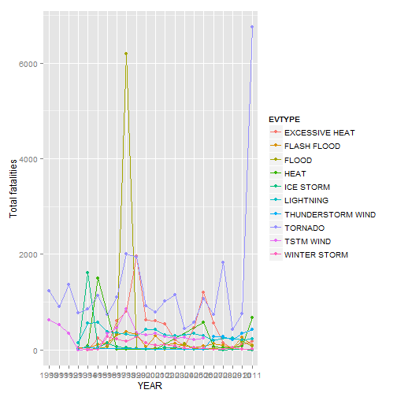
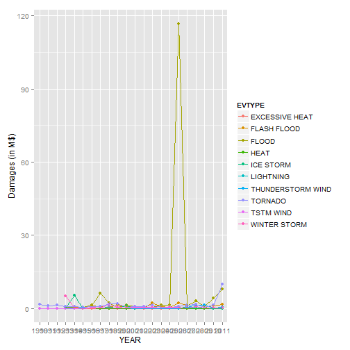

###Synopsis

###Data Analysis

```r
library(plyr)
library(ggplot2)
```

```r
data <- read.csv("C:/R/RepData_PeerAssessment2/repdata_data_StormData.csv.bz2", nrows=1000000)
data$YEAR <- format(strptime(data$BGN_DATE, format = '%m/%d/%Y'), '%Y')
```

```r
data2 <- data[data$YEAR >= 1990,]
```


```r
data2 <- data2[, c("BGN_DATE", "STATE", "EVTYPE", "FATALITIES", "INJURIES", "PROPDMG", "PROPDMGEXP", "CROPDMG", "CROPDMGEXP", "YEAR")]
values = data.frame(c('K', 'M','B'), c(1000,1000000,1000000000))
names(values) = c("PROPDMGEXP", "PROPVALUE")
data2 <- merge(data2, values, by="PROPDMGEXP", all.x = TRUE)
names(values) = c("CROPDMGEXP", "CROPVALUE")
data2 <- merge(data2, values, by="CROPDMGEXP", all.x = TRUE)
```


```r
data2[is.na(data2)] <- 0
dt <- ddply(data2, .(EVTYPE, YEAR), summarise, affected = sum(FATALITIES + INJURIES), damages = sum((((CROPDMG*CROPVALUE) + (PROPDMG*PROPVALUE))/1000000000)))
```
### Results

```r
dt2 <- ddply(dt, .(EVTYPE), summarise, affected = sum(affected), damages = sum(damages))
```
<table>
<tr>
<td>

```
##                EVTYPE affected  damages
## 834           TORNADO    28426  30.8620
## 130    EXCESSIVE HEAT     8428   0.5002
## 170             FLOOD     7259 150.3197
## 464         LIGHTNING     6046   0.9408
## 856         TSTM WIND     5349   5.0389
## 275              HEAT     3037   0.4033
## 153       FLASH FLOOD     2755  17.5621
## 427         ICE STORM     2064   8.9670
## 760 THUNDERSTORM WIND     1621   3.8980
## 972      WINTER STORM     1527   6.7154
```
</td>
<td>

```
##                EVTYPE affected damages
## 170             FLOOD     7259 150.320
## 411 HURRICANE/TYPHOON     1339  71.914
## 670       STORM SURGE       51  43.324
## 834           TORNADO    28426  30.862
## 244              HAIL     1154  18.753
## 153       FLASH FLOOD     2755  17.562
## 95            DROUGHT        4  15.019
## 402         HURRICANE      107  14.610
## 590       RIVER FLOOD        4  10.148
## 427         ICE STORM     2064   8.967
```
</td>
</tr>
</table>


```r
uni <- unique(as.character(head(dt2[order(-dt2$affected),],10)$EVTYPE), as.character(head(dt2[order(-dt2$damages),],10)$EVTYPE))
dt3 <- dt[dt$EVTYPE %in% uni,]
g <- ggplot(aes(YEAR, affected), data = dt3, colour=EVTYPE) + ylab("Total fatalities") + geom_point(aes(group=EVTYPE, color = EVTYPE)) + geom_line(aes(group=EVTYPE, color = EVTYPE))

print(g)
```

 

```r
g2 <- ggplot(aes(YEAR, damages), data = dt3, colour=EVTYPE) + ylab("Damages (in M$)")+ geom_point(aes(group=EVTYPE, color = EVTYPE)) + geom_line(aes(group=EVTYPE, color = EVTYPE))

print(g2)
```




```r
dt3 <- ddply(data2[data2$EVTYPE %in% uni, ], .(EVTYPE, STATE), summarise, affected = sum(FATALITIES + INJURIES), damages = sum((((CROPDMG*CROPVALUE) + (PROPDMG*PROPVALUE))/1000000000)))
```
<table>
<tr>
<td>

```
##             EVTYPE STATE affected  damages
## 151          FLOOD    TX     6387 0.975417
## 362        TORNADO    AL     4261 5.165207
## 24  EXCESSIVE HEAT    MO     3715 0.000379
## 404        TORNADO    TN     2567 1.368240
## 385        TORNADO    MO     2439 3.841407
## 397        TORNADO    OK     2018 1.904620
## 371        TORNADO    GA     1919 1.291779
## 237      ICE STORM    OH     1654 0.207891
## 363        TORNADO    AR     1564 1.666609
## 386        TORNADO    MS     1418 1.610882
```
</td>
<td>

```
##           EVTYPE STATE affected damages
## 110        FLOOD    CA       48 117.378
## 362      TORNADO    AL     4261   5.165
## 227    ICE STORM    MS        0   5.025
## 468 WINTER STORM    AL        8   5.002
## 150        FLOOD    TN       36   4.250
## 135        FLOOD    ND       10   3.990
## 385      TORNADO    MO     2439   3.841
## 119        FLOOD    IA      122   2.970
## 138        FLOOD    NJ       25   2.112
## 397      TORNADO    OK     2018   1.905
```
</td>
</tr>
</table>

